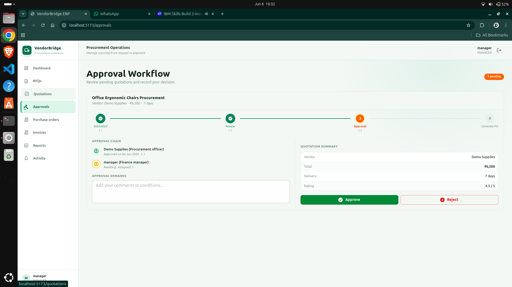
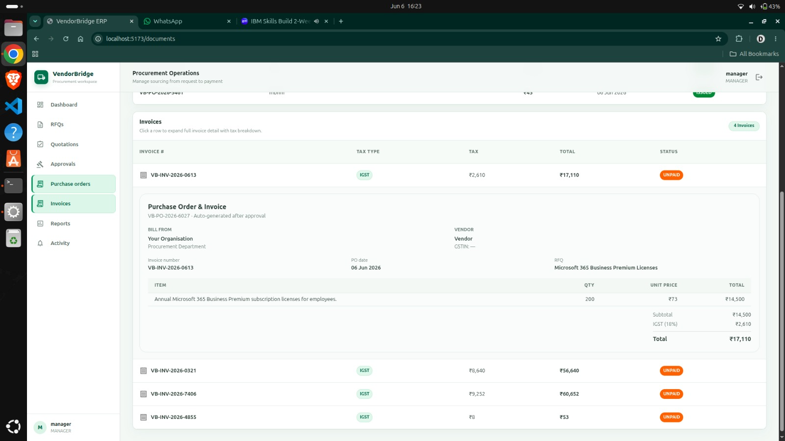
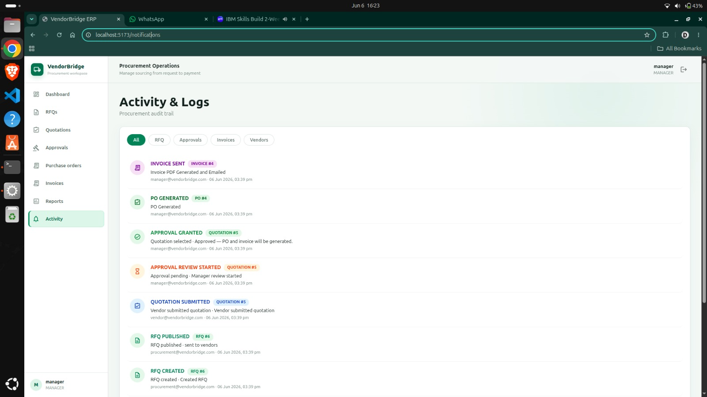
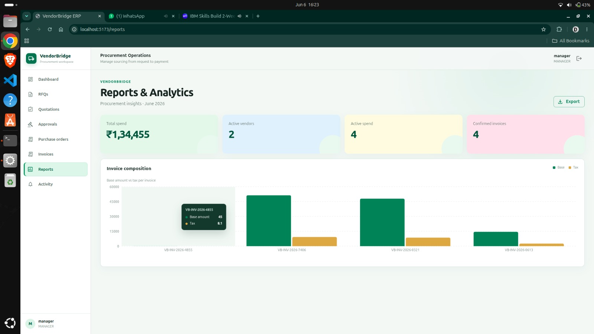

# VendorBridge — Backend

Spring Boot REST API for the VendorBridge procurement platform. Handles authentication, RFQ lifecycle, quotation comparison, approval workflow, PO/invoice generation, tax calculation, PDF export, and audit logging.

---

## Tech Stack

| Component | Technology | Version |
|---|---|---|
| Language | Java | 17 |
| Framework | Spring Boot | 3.2.4 |
| Security | Spring Security + JWT (JJWT) | 6 / 0.12.5 |
| ORM | Spring Data JPA + Hibernate | - |
| Database | PostgreSQL | 14+ |
| PDF Generation | OpenPDF | 1.3.32 |
| API Docs | SpringDoc OpenAPI | 2.5.0 |
| Build | Maven | 3.9+ |

---

## Project Structure

```
backend/src/main/java/com/vendorbridge/
│
├── VendorBridgeApplication.java
│
├── config/
│   ├── ApplicationConfig.java          Beans: PasswordEncoder, AuthManager, UserDetailsService
│   ├── DataSeeder.java                 Seeds demo users and vendors on first run
│   └── OpenApiConfig.java              Swagger UI bearer token setup
│
├── controller/
│   ├── AuthController.java             POST /auth/signup, /login, /forgot-password
│   ├── VendorController.java           GET /vendors, PATCH /vendors/{id}/status
│   ├── RfqController.java              POST /rfqs, POST /rfqs/upload, GET /rfqs/{id}/compare
│   ├── QuotationController.java        POST /quotations/submit/{rfqId}
│   ├── ApprovalController.java         GET /approvals/pending, POST /approvals/{id}
│   ├── InvoiceController.java          GET /procurement/invoice, GET /{id}/download, POST /{id}/send-email
│   ├── AnalyticsController.java        GET /analytics/dashboard
│   ├── ActivityController.java         GET /activities
│   └── UserController.java             GET /users
│
├── service/
│   ├── AuthService.java                User registration + JWT authentication
│   ├── RfqService.java                 RFQ creation with vendor assignment
│   ├── QuotationService.java           Quotation submission + comparison algorithm
│   ├── ApprovalService.java            Approval/rejection + PO + Invoice auto-generation
│   ├── AnalyticsService.java           Dashboard stats aggregation
│   ├── ProcurementStateMachine.java    Validates and logs all state transitions
│   ├── PdfGenerationService.java       OpenPDF invoice generator (in-memory stream)
│   └── EmailNotificationService.java   Mock email trigger
│
├── model/
│   ├── User.java                       email, password, role (implements UserDetails)
│   ├── Vendor.java                     name, category, GST, contact, state, status, rating
│   ├── Rfq.java                        title, productDetails, quantity, deadline, assignedVendors
│   ├── Quotation.java                  rfq, vendor, price, deliveryTimeline, notes, status, remarks
│   ├── PurchaseOrder.java              rfq, totalAmount, status, poNumber
│   ├── Invoice.java                    PO, taxAmount, totalAmount, CGST/SGST/IGST, taxType, status
│   ├── ActivityLog.java                eventType, entityType, entityId, remarks, actorName, timestamp
│   ├── OrganizationProfile.java        Buyer org state for tax routing
│   └── enums/
│       ├── Role.java                   ADMIN, MANAGER, PROCUREMENT_OFFICER, VENDOR
│       ├── ProcurementState.java       DRAFT, PUBLISHED, UNDER_REVIEW, PENDING_APPROVAL, APPROVED, REJECTED
│       ├── VendorStatus.java           PENDING, APPROVED, REJECTED
│       ├── PoStatus.java               ISSUED
│       └── InvoiceStatus.java          UNPAID, PAID, CANCELLED
│
├── dto/
│   ├── AuthRequest / AuthResponse / SignupRequest
│   ├── RfqRequest                      title, productDetails, quantity, deadline, vendorIds, attachmentName
│   ├── QuotationRequest                rfqId, price, deliveryTimeline, notes
│   ├── ApprovalRequest                 purchaseOrderApproved, approvalRemark
│   ├── QuotationComparisonDTO          vendorName, unitPrice, delivery, rating, totalWithTax, score, recommended
│   └── DashboardStats                  pendingApprovals, activeRfqs, totalVendors, totalSpent, recentPOs/Invoices
│
├── security/
│   ├── SecurityConfig.java             CORS, CSRF off, stateless, JWT filter registration
│   ├── JwtAuthenticationFilter.java    Extracts + validates Bearer token per request
│   ├── JwtService.java                 HMAC-SHA256 token generation and validation
│   └── CustomAccessDeniedHandler.java  JSON 403 response with redirect hint
│
└── util/
    └── EnglishNumberToWords.java       Converts invoice totals to words for PDF footer
```

---

## Local Setup

### Prerequisites
- Java 17+, Maven 3.9+, PostgreSQL 14+

### Database
```sql
CREATE DATABASE vendorbridge;
```

### Run
```bash
cd backend
./mvnw spring-boot:run
# API: http://localhost:8088
# Swagger: http://localhost:8088/swagger-ui.html
```

### Docker Compose
```bash
docker-compose up   # starts PostgreSQL + Spring Boot app
```

### Environment Variables
```bash
DB_URL=jdbc:postgresql://localhost:5432/vendorbridge
DB_USERNAME=postgres
DB_PASSWORD=yourpassword
SERVER_PORT=8088
```

---

## API Reference

### Authentication
```
POST  /api/v1/auth/signup                  Register user (public)
POST  /api/v1/auth/login                   Get JWT token (public)
POST  /api/v1/auth/forgot-password?email=  Password reset (public)
```

### Vendors
```
GET   /api/v1/vendors?q=              List/search vendors           [ADMIN, PROCUREMENT]
GET   /api/v1/vendors/{id}            Get vendor                    [authenticated]
PATCH /api/v1/vendors/{id}/status     Approve or block              [ADMIN]
```

### RFQs
```
POST  /api/v1/rfqs                    Create and publish RFQ        [PROCUREMENT]
POST  /api/v1/rfqs/upload             Upload attachment             [PROCUREMENT]
GET   /api/v1/rfqs                    List all RFQs                 [authenticated]
GET   /api/v1/rfqs/{id}/quotations    List quotations for RFQ       [PROCUREMENT, MANAGER]
GET   /api/v1/rfqs/{id}/compare       Comparison DTOs               [PROCUREMENT, MANAGER]
```

### Quotations
```
POST  /api/v1/quotations/submit/{id}  Submit quotation              [VENDOR]
```

### Approvals
```
GET   /api/v1/approvals/pending       Pending queue                 [MANAGER, ADMIN]
POST  /api/v1/approvals/{id}          Approve or reject             [MANAGER]
```

### Documents
```
GET   /api/v1/procurement/invoice                    List invoices  [PROCUREMENT, ADMIN, MANAGER]
GET   /api/v1/procurement/invoice/purchase-orders    List POs       [PROCUREMENT, ADMIN, MANAGER]
GET   /api/v1/procurement/invoice/{id}/download      PDF download   [PROCUREMENT, ADMIN]
POST  /api/v1/procurement/invoice/{id}/send-email    Email vendor   [PROCUREMENT, ADMIN]
```

### Analytics & Logs
```
GET   /api/v1/analytics/dashboard     Dashboard stats               [ADMIN, MANAGER]
GET   /api/v1/activities              Recent 10 events              [ADMIN, MANAGER, PROCUREMENT]
GET   /api/v1/users                   All users                     [ADMIN]
```

---

## Core Business Logic

### Procurement State Machine

`ProcurementStateMachine.transitionState()` — called on every lifecycle change:
1. Validates transition is legal (no state skipping)
2. Appends an `ActivityLog` entry (immutable — no UPDATE or DELETE ever)
3. Throws `RuntimeException` on illegal jump

```
RFQ:        DRAFT → PUBLISHED → UNDER_REVIEW
Quotation:  (created) → UNDER_REVIEW → PENDING_APPROVAL → APPROVED | REJECTED
```

### Quotation Comparison Algorithm

```
pricePerformanceScore = vendorRating / unitPrice

Sorting (sortBy param):
  score        — descending score (default)
  price        — ascending price
  deliverytime — ascending delivery days
  rating       — descending vendor rating

Recommendation badge: highest score → isRecommended = true
```

### Tax Calculation

```
if vendor.state == organizationProfile.state:
    CGST = base × 9%,  SGST = base × 9%   (taxType = CGST_SGST)
else:
    IGST = base × 18%                      (taxType = IGST)
```

### Auto-generated Document Numbers
```
Purchase Order:  VB-PO-{YEAR}-{sequence}    e.g. VB-PO-2025-0042
Invoice:         VB-INV-{YEAR}-{prefix}     e.g. VB-INV-2025-a3f1
```

---

## Security

| Concern | Implementation |
|---|---|
| Authentication | Stateless JWT, HMAC-SHA256, 24h expiry |
| Authorisation | Method-level `@PreAuthorize` on every endpoint |
| Password storage | BCrypt via Spring Security |
| CORS | Allows localhost:5173, methods: GET/POST/PUT/PATCH/DELETE/OPTIONS |
| CSRF | Disabled (stateless API) |
| 403 response | JSON with message + `/dashboard` redirect hint |

---

## Demo Accounts

Seeded by `DataSeeder` on first run:

| Role | Email | Password |
|---|---|---|
| Admin | admin@vendorbridge.com | admin123 |
| Manager | manager@vendorbridge.com | manager123 |
| Procurement Officer | procurement@vendorbridge.com | procurement123 |
| Vendor | vendor@vendorbridge.com | vendor123 |

---

## Screenshots

### Approval Workflow (Backend driven)

*4-step approval card — manager decision triggers PO + Invoice auto-generation via ApprovalService.*

### Purchase Orders & Invoices

*Expandable invoice rows with full CGST/SGST/IGST breakdown — tax type determined by vendor vs org state.*

### Activity & Audit Logs

*Immutable ActivityLog — every state transition recorded by ProcurementStateMachine.*

### Reports & Analytics

*Dashboard stats served by AnalyticsService from /api/v1/analytics/dashboard.*

### Database Entity Relationships
```
users ──< vendors              (one user → one vendor profile)
users ──< rfqs                 (created_by)
rfqs  ──< rfq_assigned_vendors >── vendors  (many-to-many)
rfqs  ──< quotations
vendors ──< quotations
quotations ── purchase_orders  (one-to-one on approval)
purchase_orders ── invoices    (one-to-one auto-generated)
activity_logs                  (append-only, actor = user)
organization_profile           (single-row buyer org config)
```
